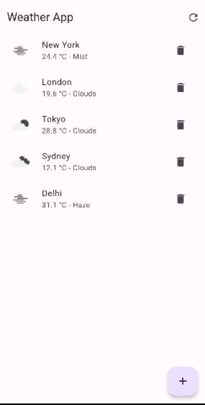
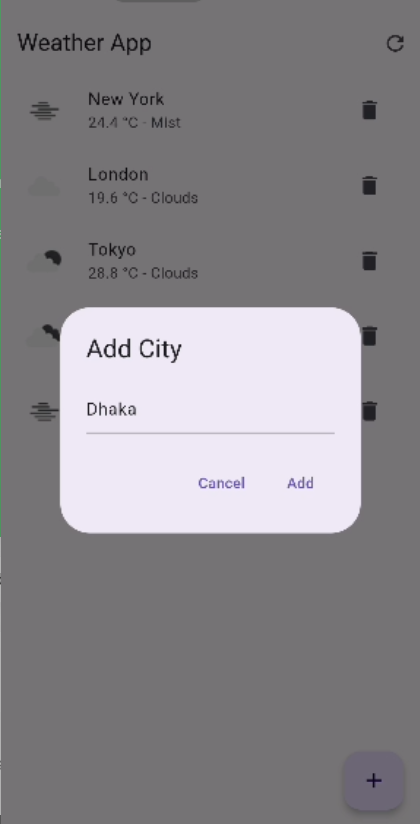

#Zaynax Weather App
,
,
# Flutter Weather App

A simple Flutter application that fetches and displays weather information for a list of cities using the OpenWeatherMap API.

## Features

- Displays weather information for predefined cities.
- Pull-to-refresh functionality to update weather data.
- Add or remove cities dynamically.
- Handles errors gracefully with snack bar notifications.

## Setup

### Prerequisites

- [Flutter SDK](https://flutter.dev/docs/get-started/install)
- [Android Studio](https://developer.android.com/studio) or [Visual Studio Code](https://code.visualstudio.com/) with Flutter extension
- A [GitHub](https://github.com/) account
- An API key from [OpenWeatherMap](https://openweathermap.org/)

### Steps

1. **Clone the Repository**

    ```bash
    git clone https://github.com/shahriartoky0/https://github.com/shahriartoky0/zaynax_weather/tree/master.git
    cd your-repo-name
    ```

2. **Install Dependencies**

    ```bash
    flutter pub get
    ```

3. **Obtain OpenWeatherMap API Key**

    - Go to [OpenWeatherMap](https://openweathermap.org/) and sign up.
    - Navigate to the [API keys section](https://home.openweathermap.org/api_keys) to generate a new API key.

4. **Configure API Key**

    - Create a `.env` file in the root directory of your project.
    - Add your OpenWeatherMap API key to the `.env` file:

      ```plaintext
      WEATHER_API_KEY=your_api_key_here
      ```

5. **Run the App**

    ```bash
    flutter run
    ```

## Usage

- **Add a City**: Click the floating action button, enter the city name, and click "Add".
- **Delete a City**: Swipe left on a city item to delete it.
- **Refresh Weather Data**: Pull down on the list to refresh or click the refresh icon in the app bar.

## Folder Structure

lib
│── controller
│ ├── weather_controller.dart
│ └── weather_provider.dart
│── models
│ └── weather.dart
│── screens
│ └── weather_screen.dart
│ └── add_city.dart
└── main.dart

## Contributing

1. Fork the repository.
2. Create a new branch (`git checkout -b feature/YourFeature`).
3. Make your changes and commit (`git commit -m 'Add some feature'`).
4. Push to the branch (`git push origin feature/YourFeature`).
5. Create a new Pull Request.

## License

This project is licensed under the MIT License. See the [LICENSE](LICENSE) file for details.
